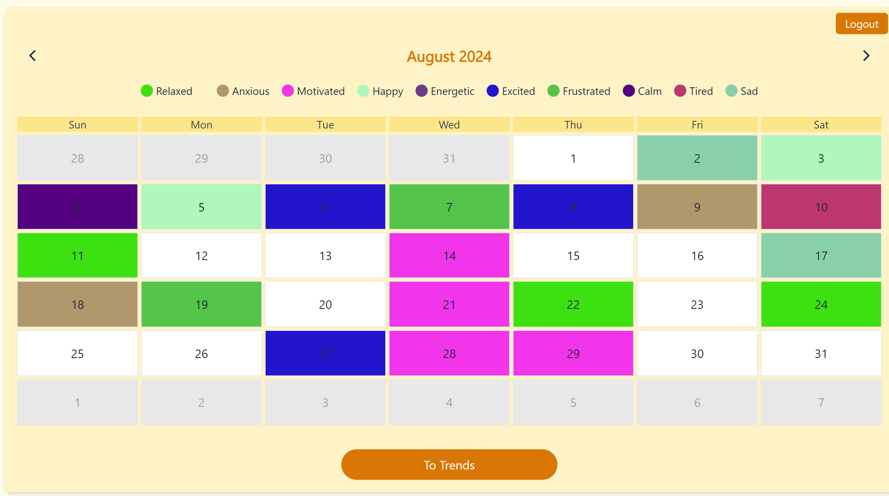
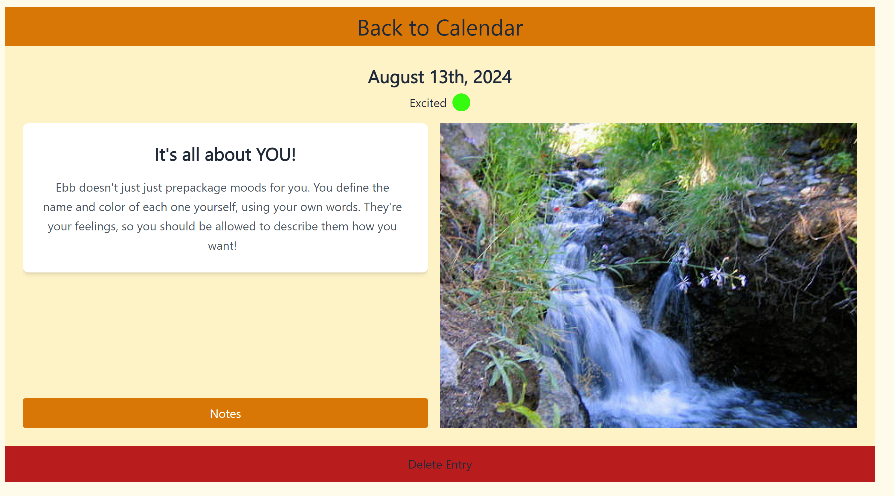
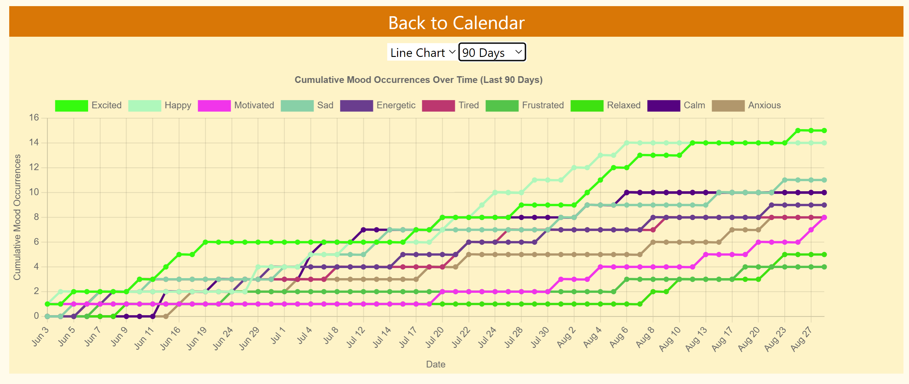
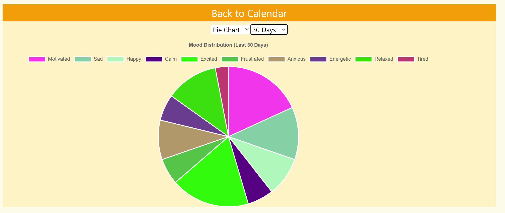
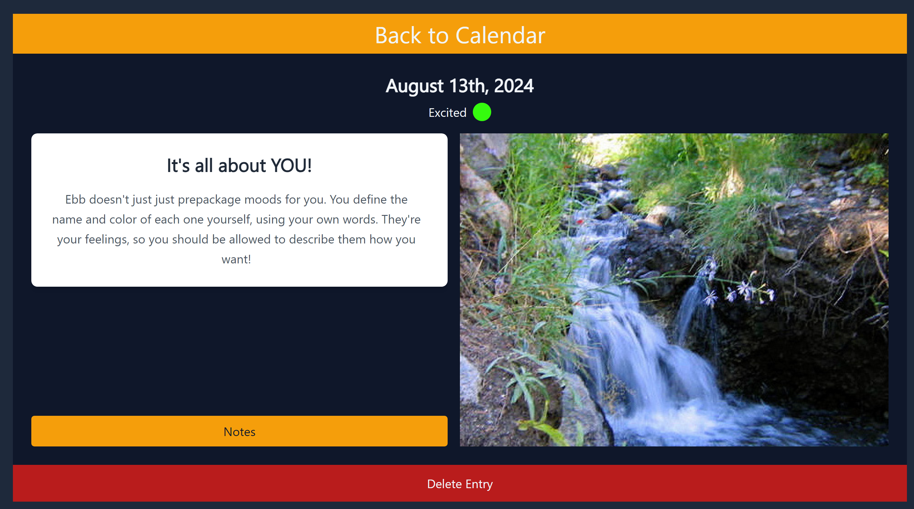

# Ebb - Journaling and Mood Tracking

Ebb is a powerful journaling application that combines daily entries with mood tracking, providing users with a visual representation of their emotional journey over time.

## Features

- **Daily Journaling**: Write and store your thoughts, experiences, and reflections.
- **Mood Tracking**: Associate each entry with a mood and corresponding color.
- **Calendar Interface**: View your entries and moods on an intuitive calendar layout.
- **Trend Analysis**: Track and visualize your mood trends over time.
- **Color-Coded Entries**: Quickly gauge your emotional state with color-coded calendar cells.
- **Light and Dark Mode**: Customize your journaling experience with adjustable themes for comfort in any lighting condition.

## Technology Stack

- Frontend: TypeScript, React
- Data Visualization: ChartJS
- Styling: Tailwind CSS
- Backend: Python
- Database: PostgreSQL

## Installation

As Ebb is currently not deployed, follow these steps to run it locally:

1. Clone the repository:
   ```
   git clone https://github.com/yourusername/ebb.git
   cd ebb
   ```

2. Set up the backend:
   ```
   cd backend
   pipenv shell
   pip install -r requirements.txt
   ```

3. Set up the frontend:
   ```
   cd ..
   npm install
   ```

## Usage

1. Start the backend server:
   ```
   cd backend
   pipenv shell
   python app.py
   ```

2. In a new terminal, start the frontend development server:
   ```
   npm run dev
   ```

3. Open your browser and navigate to `http://localhost:3000` (or the port specified by your React setup).

4. Register for a new account or log in to start journaling and tracking your mood!

## Screenshots

### Calendar View with Color-Coded Cells


### Journal Entries


### Mood Trend Analysis View



### Light and Dark Mode Comparison
<p float="left">
  
  
</p>

## Issues and Support

If you encounter any issues or have questions, please file an issue on our [GitHub issues page](https://github.com/yourusername/ebb/issues).

## License

This project is licensed under the GNU General Public License (GPL). See the [LICENSE](LICENSE) file for details.

## Disclaimer

Ebb is a personal project and is not intended to be a substitute for professional medical advice, diagnosis, or treatment. Always seek the advice of your physician or other qualified health provider with any questions you may have regarding a medical condition.